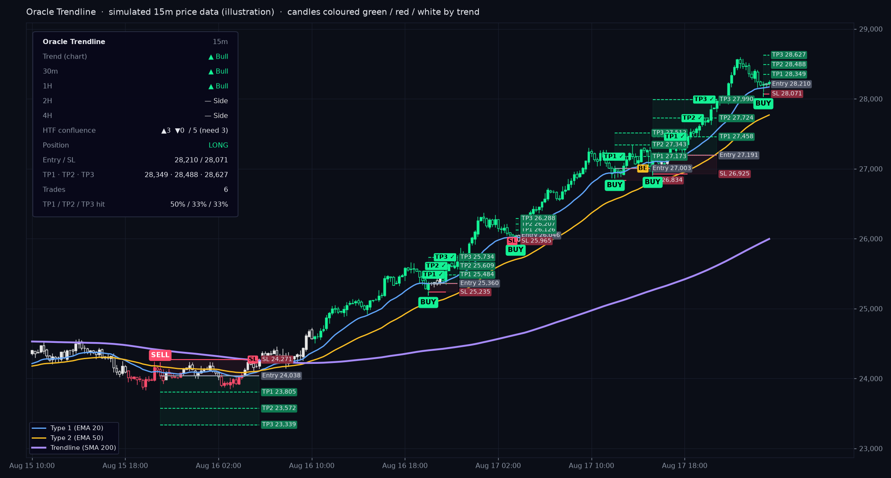

# Oracle Trendline (TradingView indicator)

A from-scratch Pine Script v5 indicator that works the way the public
description of **ZynAlgo Trendline** says it works. ZynAlgo's script is
invite-only and closed source, so this code is not copied from it. It follows
their published feature list, and every threshold is a setting you can change.

*Preview drawn from a Python port of the script's logic on simulated prices, not a TradingView screenshot.*

> Not financial advice. It draws levels and sends alerts. It never places a trade.

## Install

1. TradingView → **Pine Editor** → *Open → New blank indicator*.
2. Paste the contents of [`oracle-trendline.pine`](./oracle-trendline.pine) → **Save** → **Add to chart**.

## How it works

| Piece | Logic |
|---|---|
| **3 MA layers** | Type 1 = fast (EMA 20), Type 2 = medium (EMA 50), Trendline = base (SMA 200). Each can be SMA / EMA / WMA / RMA / HMA / SWMA / ALMA / VWMA / VWAP. |
| **Trend** | **Bull** when Type 1 > Type 2 > Trendline, all three slope up, and the MAs are spaced apart. **Bear** is the mirror. Anything else counts as **Sideways**. |
| **Chop filter** | Type 1 and Type 2 each need a slope above *Min slope* (% per bar over the lookback). The Trendline needs a slope above its own minimum (default: just positive or negative). The MAs must be at least *Min separation* % of price apart. |
| **Candle colours** | Green = uptrend, red = downtrend, white = sideways / no-trade. |
| **Entry** | While trending, price touches the confirmation line (Type 1 or Type 2). Within *N* candles it then closes back on the trend side with a candle in the trend direction. Each touch gives at most one signal. |
| **Multi-timeframe** | Up to 8 timeframes (5m, 15m, 30m, 1H, 2H, 4H, 12H, D) run the same trend test. A signal counts only if at least *Min timeframes agreeing* of them match. Timeframes below the chart's are skipped. |
| **SL** | *Swing*: lowest low / highest high of the last N bars ± an ATR buffer. *ATR*: entry ± ATR × multiplier. *Type 2 line*: the medium MA ± an ATR buffer. |
| **TP1-TP3** | Entry + risk × R:R (default 1R / 2R / 3R). Optionally moves the stop to entry after TP1. |
| **Tracking** | Entry, SL and TP lines extend until the trade ends. The chart marks TP hits and SL/BE exits. An opposite signal reverses the trade. |
| **Dashboard** | Chart trend, each timeframe's vote, confluence count, open position with its levels, and TP hit rates. |

### No repainting

- Signals and trade management run only on **closed** bars (`barstate.isconfirmed`).
- Higher-timeframe values use the previous **closed** HTF bar
  (`f_trend()[1]` with `lookahead_on`), the standard non-repainting pattern.

When the stop and a target fall inside the same candle, the indicator assumes
the stop was hit first (the conservative choice).

## Alerts

- **Simple conditions:** *Buy signal*, *Sell signal*, *Trend turned bullish / bearish / sideways*.
- **Full detail:** create an alert with condition **Any alert() function call**.
  You get messages like
  `BUY XAUUSD [15] entry 2650.10 | SL 2644.80 | TP1 2655.40 | TP2 2660.70 | TP3 2666.00 | HTF 5/7`,
  plus TP1/TP2/TP3 hits and SL/BE exits.

To get these on your phone, point the alert's webhook at the existing
[`tv-webhook`](../tv-webhook) Cloudflare Worker. It relays any plain-text alert to Telegram.

## Tuning tips

- **Gold / forex scalping (1-5m):** keep MTF on with *Min timeframes agreeing* 3-4, and set *Min slope* to 0.005-0.01.
- **Too few signals:** lower *Min slope* or *Min separation*, raise *Re-confirm within*, or switch the confirmation line to Type 2.
- **Too many signals in chop:** raise *Min slope* or *Min timeframes agreeing*.
